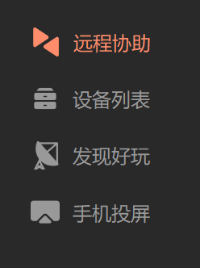

# 高仿花生壳客户端程序

## 前言
设计的初想是在现场调试的时候，使用花生壳进行远程时，感觉类似花生壳这种程序的模板较为普遍，当时和同事打趣说一个星期内可以做出一摸一样的界面，回到公司正好赶上离职，有时间想做一些东西，看到花生壳程序程序，瞬间想拿他用qt练手，于是三天时间仿制了该界面。

原生界面

  

仿制界面

  

## 开发
基于QT5.12.10 MSVC2015 进行设计，目前只测试过64位的编译和运行，没有进行详细的测试，仅供参考。

配色基本使用qss进行完成，包括图像的切换等，但是qss写的时候比较散乱，都是在designer中直接进行书写，一般会在要设置的控件的父元素中进行设置，部分直接在当前控件中进行设置，所以阅读起来可能要自己找一下，如果有癖好的也可以把qss弄成全局的文件进行读写，自由修改吧，小伙伴们！

下面介绍一下设计中的关键要点

1. 无标题栏 无边框
    
    这个比较简单，在主窗口的构造函数中直接添加
    ~~~
    setWindowFlags(Qt::FramelessWindowHint);
    setAttribute(Qt::WA_StyledBackground);
    ~~~
2. 自定义标题栏

    这个需求目前也比较多，原理无非就是自己片段鼠标的行为和可拖动的区域，通过重写以下的函数完成设置区域的dragable的属性
    ~~~
    virtual void mousePressEvent(QMouseEvent *event);
    virtual void mouseReleaseEvent(QMouseEvent *event);
    virtual void mouseMoveEvent(QMouseEvent *event);
    ~~~

3. tab按钮的状态保持

    tab标签按钮这个是在做一个其他项目中遇到的，因为有几个状态的显示问题，所以单纯的使用qss无法完成。问题主要是**在图标和问题同时显示并且要切换图标** 和 **和点击选择以后维持状态的问题**。
    我当时是写了一个QToolPushButton的类进行状态图标的控制，使用qss完成文字等的状态切换，如果大家有更好的方案，可以更改。

  

4. 其他
   
   该界面只是仿制向日葵程序的界面进行交流学习，界面的解释和使用权归该软件的公司；

   程序界面并非1：1还原，大小、颜色等有出入。

   对于程序中使用的图标都来自iconfont网站；

   欢迎G友进行完善！！
